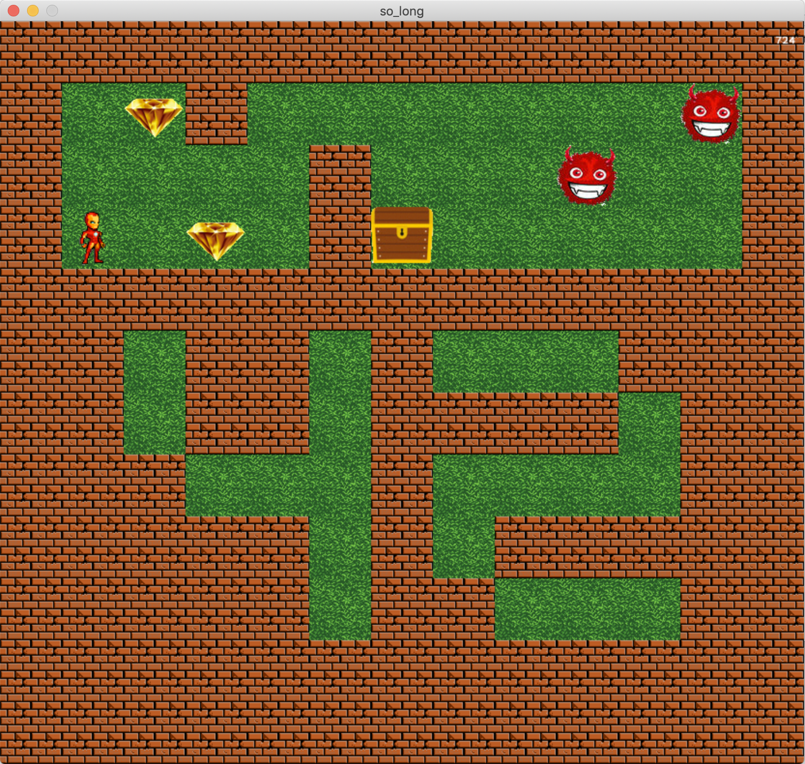

# so_long 42

This project is a small 2D game with minilibx. You'll learn about textures, sprites and tiles.

An implementation of the 42 project so_long with all bonus.  
It has animations (kind of), an enemy patroling and nice textures with varying trees as walls.  

You need minilibx installed to be able to play this game. 
Don't have it? 42Paris has a nice installation guide.
It also provides some maps you can test around with.  

Error handling is done accordingly.

Concepts which may be interesting for you:
- Using mlx_loop_hook to get arbitrary numbers (they are **not** random)
- Use static to save variable references (look as example in the free function in main.c) (I actually don't think this is good practice at ALL)

Memory leaks: None I would be aware of :D

